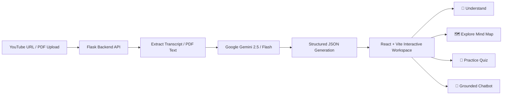

# 🍳 Concept Chef

**Concept Chef** is an AI-powered learning workspace that transforms long educational content—such as YouTube videos and PDF documents—into an interactive, multi-stage study guide. By extracting transcripts and document text, Concept Chef leverages Google Gemini to synthesize structured summaries, intuitive analogies, interactive visual mind maps, practice quizzes, and a source-grounded chatbot with video timestamp citations.

---

## ✨ Key Features

- **Multi-Source Ingestion**:
  - **YouTube Videos**: Automatically extracts video transcripts with millisecond-accurate timestamps across multiple languages.
  - **PDF Documents**: Parses and extracts text from uploaded multi-page PDF documents.
- **Customizable Learning Parameters**:
  - **Persona / Explanation Style**: Customize explanations for your preferred learning style (e.g., Simple/Beginner, 5-Year-Old, Academic, Software Engineer).
  - **Quiz Configuration**: Customize question counts (1–100) and difficulty levels (*Easy*, *Medium*, *Hard*, *Mix*).
- **Four-Stage Learning Workspace**:
  1. 📖 **Understand**: Clean bullet-point summaries and creative metaphorical analogies that demystify complex concepts.
  2. 🗺️ **Explore**: Dynamic, interactive visual mind maps powered by Mermaid.js to visualize hierarchies and relationships.
  3. 🎯 **Test**: Practice quizzes featuring multiple-choice options, instant validation, answer keys, and detailed explanations.
  4. 💬 **Ask**: An interactive AI tutor grounded strictly in the source material. For YouTube videos, responses include clickable **timestamp citations** (`[seconds]`) to jump straight to the source context.
- **Markdown Export**: One-click download of your generated study notes, summaries, analogies, and quizzes as a structured `.md` file.

---

## 🛠️ How It Works



1. **Extraction**: The Flask backend extracts the full transcript from a YouTube URL via `youtube-transcript-api` or extracts text from an uploaded PDF via `PyPDF2`.
2. **Generation**: The text is processed by Google Gemini using structured prompt engineering to generate JSON output containing summaries, analogies, Mermaid flowchart code, and quizzes.
3. **Interactive UI**: The React frontend displays the content in a responsive 4-stage rail, allowing students to learn, visualize, self-test, and ask questions interactively.

---

## 💻 Tech Stack

### Frontend
- **Framework**: [React 19](https://react.dev/) with [TypeScript](https://www.typescriptlang.org/)
- **Build Tool**: [Vite](https://vitejs.dev/)
- **Styling**: [Tailwind CSS v4](https://tailwindcss.com/)
- **UI & Icons**: [Radix UI](https://www.radix-ui.com/), [Lucide React](https://lucide.dev/)
- **Diagrams**: [Mermaid.js](https://mermaid.js.org/)
- **Animations**: [Motion (Framer Motion)](https://motion.dev/)

### Backend
- **Framework**: [Flask](https://flask.palletsprojects.com/) & [Flask-CORS](https://flask-cors.readthedocs.io/)
- **AI Model**: [Google Generative AI SDK](https://ai.google.dev/) (`gemini-2.5-flash` / `gemini-flash-lite-latest`)
- **Parsers**: `youtube-transcript-api`, `PyPDF2`
- **Environment Management**: `python-dotenv`
- **WSGI / Production Server**: `gunicorn`

---

## 📁 Project Structure

```text
├── app.py                  # Flask backend server & API routes (/generate, /chat, /export)
├── requirements.txt        # Python backend dependencies
├── .env.example            # Environment variable template
├── package.json            # Frontend dependencies and scripts
├── vite.config.ts          # Vite build configuration
├── tsconfig.json           # TypeScript configuration
├── uploads/                # Temporary local storage for uploaded PDF files
├── templates/              # HTML fallback template
├── public/                 # Static assets
└── src/                    # Frontend application source code
    ├── components/         # Workspace UI components
    │   ├── SourceForm.tsx  # Input form for YouTube URL and PDF upload
    │   ├── StageRail.tsx   # Navigation rail for workspace stages
    │   ├── Understand.tsx  # Summary & analogy display
    │   ├── Explore.tsx     # Interactive Mermaid mind map renderer
    │   ├── Test.tsx        # Interactive quiz runner & scorekeeper
    │   ├── Ask.tsx         # AI tutor chat with timestamp chips
    │   └── ui/             # Reusable UI primitives
    ├── routes/             # TanStack / Application routes
    ├── styles.css          # Global styling & Tailwind CSS directives
    └── router.tsx          # Router configuration
```

---

## ⚙️ Getting Started

> **Important Note**: The **Flask backend** and **React frontend** run as two separate development services that communicate over HTTP/CORS. You will need two terminal windows open.

### Prerequisites
- **Node.js** (v18.0.0 or higher) & `npm` / `bun`
- **Python** (v3.9 or higher) & `pip`
- A **Google Gemini API Key** (get one free at [Google AI Studio](https://aistudio.google.com/))

---

### 1. Backend Setup

1. Open a terminal and navigate to the project directory:
   ```bash
   cd AICTC-1M1B
   ```

2. Create and activate a Python virtual environment (recommended):
   - **Windows (PowerShell)**:
     ```powershell
     python -m venv venv
     .\venv\Scripts\Activate.ps1
     ```
   - **macOS / Linux**:
     ```bash
     python3 -m venv venv
     source venv/bin/activate
     ```

3. Install backend dependencies:
   ```bash
   pip install -r requirements.txt
   ```

4. Configure environment variables:
   - Create a `.env` file in the root directory (or copy `.env.example`):
     ```bash
     cp .env.example .env
     ```
   - Add your Gemini API key to `.env`:
     ```env
     GEMINI_API_KEY=your_actual_gemini_api_key_here
     ```

5. Start the Flask backend server:
   ```bash
   python app.py
   ```
   The Flask server will start on **`http://localhost:5000`**.

---

### 2. Frontend Setup

1. Open a **second terminal** and navigate to the project root:
   ```bash
   cd AICTC-1M1B
   ```

2. Install frontend dependencies:
   ```bash
   npm install
   ```

3. Start the Vite development server:
   ```bash
   npm run dev
   ```
   The frontend will be available at **`http://localhost:5173`** (or the port shown in your terminal).

---

## 🚀 Basic Usage

1. Open your browser and go to `http://localhost:5173`.
2. **Choose Source**:
   - Select **YouTube Video** and paste any educational video URL (ensure captions/subtitles are enabled on the video).
   - *OR* select **PDF Document** and upload a PDF lecture note, paper, or textbook chapter.
3. **Configure Settings**:
   - Choose an explanation style / persona.
   - Set the number of quiz questions and difficulty level.
4. **Generate Workspace**: Click **Cook Concept** to analyze and build your learning space.
5. **Explore Stages**:
   - Review the **Summary & Analogy** in the **Understand** stage.
   - Navigate the visual flowchart in the **Explore** stage.
   - Test your understanding in the **Test** stage and check your score.
   - Ask clarifying questions in the **Ask** stage and jump to video timestamps.
6. **Export Notes**: Click **Export Notes** in the top navigation to download your notes in Markdown format.

---

## 🔒 API Reference

| Endpoint | Method | Description |
|---|---|---|
| `/generate` | `POST` | Accepts `source_type` (`youtube` / `pdf`), `url` or `file`, `style`, `q_count`, and `difficulty`. Returns parsed study materials and `session_id`. |
| `/chat` | `POST` | Accepts JSON `{ "session_id": "...", "message": "..." }`. Returns contextual reply from AI tutor with timestamp citations. |
| `/export` | `GET` | Accepts query param `?session_id=...`. Downloads the session notes as a `.md` Markdown file. |

---

## 📄 License

Distributed under the MIT License. See `LICENSE` for more information.
